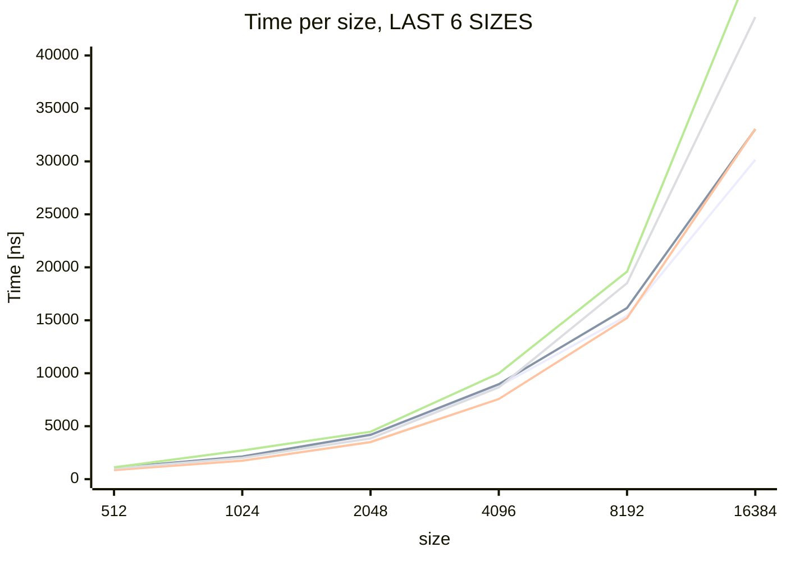
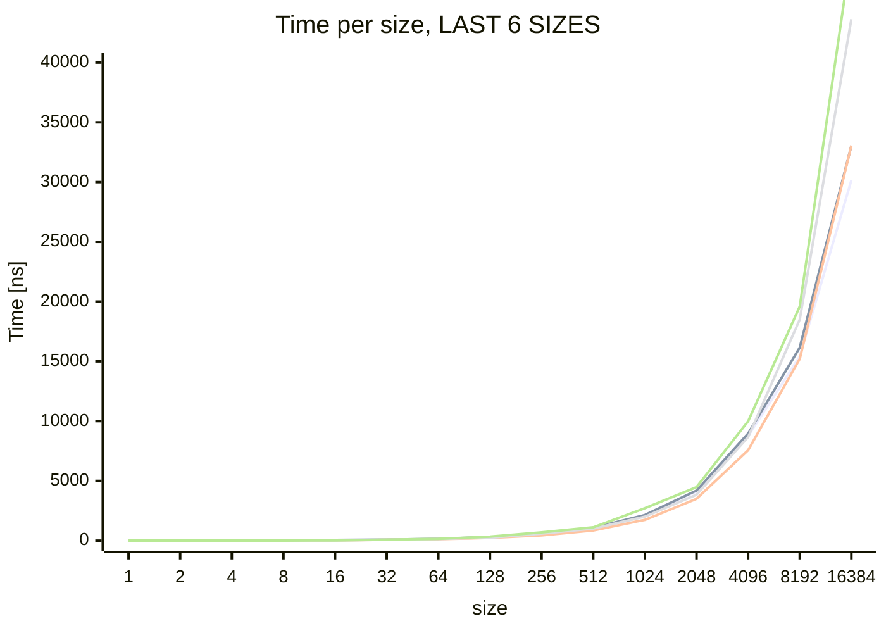

# Benchmark






## Data

```log
go test -benchmem -run=^$$ -bench . . -cpuprofile cpu.out
goos: windows
goarch: amd64
pkg: github.com/DaanV2/go-fast-hex
cpu: Intel(R) Core(TM) i7-7700K CPU @ 4.20GHz
BenchmarkVectorEncodeUpper/Size(1)-8            88694418                14.92 ns/op            2 B/op          1 allocs/op
BenchmarkVectorEncodeUpper/Size(2)-8            81627099                16.74 ns/op            4 B/op          1 allocs/op
BenchmarkVectorEncodeUpper/Size(4)-8            68761996                19.73 ns/op            8 B/op          1 allocs/op
BenchmarkVectorEncodeUpper/Size(8)-8            40184984                27.83 ns/op           16 B/op          1 allocs/op
BenchmarkVectorEncodeUpper/Size(16)-8           21434847                55.69 ns/op           32 B/op          1 allocs/op
BenchmarkVectorEncodeUpper/Size(32)-8           14681754                75.24 ns/op           64 B/op          1 allocs/op
BenchmarkVectorEncodeUpper/Size(64)-8            8817868               138.9 ns/op           128 B/op          1 allocs/op
BenchmarkVectorEncodeUpper/Size(128)-8           4682050               260.1 ns/op           256 B/op          1 allocs/op
BenchmarkVectorEncodeUpper/Size(256)-8           2340063               533.2 ns/op           512 B/op          1 allocs/op
BenchmarkVectorEncodeUpper/Size(512)-8           1000000              1055 ns/op            1024 B/op          1 allocs/op
BenchmarkVectorEncodeUpper/Size(1024)-8           616490              2125 ns/op            2048 B/op          1 allocs/op
BenchmarkVectorEncodeUpper/Size(2048)-8           279369              4119 ns/op            4096 B/op          1 allocs/op
BenchmarkVectorEncodeUpper/Size(4096)-8           134524              8757 ns/op            8192 B/op          1 allocs/op
BenchmarkVectorEncodeUpper/Size(8192)-8            76454             15417 ns/op           16384 B/op          1 allocs/op
BenchmarkVectorEncodeUpper/Size(16384)-8           40266             30152 ns/op           32768 B/op          1 allocs/op
BenchmarkVectorEncodeLower/Size(1)-8            81197390                14.31 ns/op            2 B/op          1 allocs/op
BenchmarkVectorEncodeLower/Size(2)-8            82547980                15.66 ns/op            4 B/op          1 allocs/op
BenchmarkVectorEncodeLower/Size(4)-8            61301428                20.30 ns/op            8 B/op          1 allocs/op
BenchmarkVectorEncodeLower/Size(8)-8            36412516                27.77 ns/op           16 B/op          1 allocs/op
BenchmarkVectorEncodeLower/Size(16)-8           16916751                59.63 ns/op           32 B/op          1 allocs/op
BenchmarkVectorEncodeLower/Size(32)-8           14068192                84.58 ns/op           64 B/op          1 allocs/op
BenchmarkVectorEncodeLower/Size(64)-8            7330872               151.3 ns/op           128 B/op          1 allocs/op
BenchmarkVectorEncodeLower/Size(128)-8           4573574               304.9 ns/op           256 B/op          1 allocs/op
BenchmarkVectorEncodeLower/Size(256)-8           2309997               529.6 ns/op           512 B/op          1 allocs/op
BenchmarkVectorEncodeLower/Size(512)-8            940636              1067 ns/op            1024 B/op          1 allocs/op
BenchmarkVectorEncodeLower/Size(1024)-8           508224              2145 ns/op            2048 B/op          1 allocs/op
BenchmarkVectorEncodeLower/Size(2048)-8           260365              4190 ns/op            4096 B/op          1 allocs/op
BenchmarkVectorEncodeLower/Size(4096)-8           134577              8962 ns/op            8192 B/op          1 allocs/op
BenchmarkVectorEncodeLower/Size(8192)-8            65143             16163 ns/op           16384 B/op          1 allocs/op
BenchmarkVectorEncodeLower/Size(16384)-8           34752             33040 ns/op           32768 B/op          1 allocs/op
BenchmarkTabledEncodeUpper/Size(1)-8            454943874                2.667 ns/op           0 B/op          0 allocs/op
BenchmarkTabledEncodeUpper/Size(2)-8            332728875                3.597 ns/op           0 B/op          0 allocs/op
BenchmarkTabledEncodeUpper/Size(4)-8            218314552                5.610 ns/op           0 B/op          0 allocs/op
BenchmarkTabledEncodeUpper/Size(8)-8            125740005                9.604 ns/op           0 B/op          0 allocs/op
BenchmarkTabledEncodeUpper/Size(16)-8           65072040                18.24 ns/op            0 B/op          0 allocs/op
BenchmarkTabledEncodeUpper/Size(32)-8           17135366                67.23 ns/op           64 B/op          1 allocs/op
BenchmarkTabledEncodeUpper/Size(64)-8            9767166               121.1 ns/op           128 B/op          1 allocs/op
BenchmarkTabledEncodeUpper/Size(128)-8           4934918               223.8 ns/op           256 B/op          1 allocs/op
BenchmarkTabledEncodeUpper/Size(256)-8           2843952               435.8 ns/op           512 B/op          1 allocs/op
BenchmarkTabledEncodeUpper/Size(512)-8           1450508               858.0 ns/op          1024 B/op          1 allocs/op
BenchmarkTabledEncodeUpper/Size(1024)-8           820983              1742 ns/op            2048 B/op          1 allocs/op
BenchmarkTabledEncodeUpper/Size(2048)-8           342513              3503 ns/op            4096 B/op          1 allocs/op
BenchmarkTabledEncodeUpper/Size(4096)-8           179643              7564 ns/op            8194 B/op          1 allocs/op
BenchmarkTabledEncodeUpper/Size(8192)-8            85340             15211 ns/op           16384 B/op          1 allocs/op
BenchmarkTabledEncodeUpper/Size(16384)-8           39160             33062 ns/op           32768 B/op          1 allocs/op
BenchmarkTabledEncodeLower/Size(1)-8            391143723                2.720 ns/op           0 B/op          0 allocs/op
BenchmarkTabledEncodeLower/Size(2)-8            337419008                3.615 ns/op           0 B/op          0 allocs/op
BenchmarkTabledEncodeLower/Size(4)-8            223412638                5.471 ns/op           0 B/op          0 allocs/op
BenchmarkTabledEncodeLower/Size(8)-8            126194548                9.509 ns/op           0 B/op          0 allocs/op
BenchmarkTabledEncodeLower/Size(16)-8           65775049                17.36 ns/op            0 B/op          0 allocs/op
BenchmarkTabledEncodeLower/Size(32)-8           16431715                72.66 ns/op           64 B/op          1 allocs/op
BenchmarkTabledEncodeLower/Size(64)-8            8716244               139.3 ns/op           128 B/op          1 allocs/op
BenchmarkTabledEncodeLower/Size(128)-8           5111792               248.5 ns/op           256 B/op          1 allocs/op
BenchmarkTabledEncodeLower/Size(256)-8           2247148               592.1 ns/op           512 B/op          1 allocs/op
BenchmarkTabledEncodeLower/Size(512)-8           1299994              1009 ns/op            1024 B/op          1 allocs/op
BenchmarkTabledEncodeLower/Size(1024)-8           627888              2008 ns/op            2048 B/op          1 allocs/op
BenchmarkTabledEncodeLower/Size(2048)-8           319112              3843 ns/op            4096 B/op          1 allocs/op
BenchmarkTabledEncodeLower/Size(4096)-8           138283              8668 ns/op            8192 B/op          1 allocs/op
BenchmarkTabledEncodeLower/Size(8192)-8            61402             18504 ns/op           16384 B/op          1 allocs/op
BenchmarkTabledEncodeLower/Size(16384)-8           30468             43631 ns/op           32768 B/op          1 allocs/op
BenchmarkStdEncode/Size(1)-8                    420032026                2.861 ns/op           0 B/op          0 allocs/op
BenchmarkStdEncode/Size(2)-8                    321473806                3.801 ns/op           0 B/op          0 allocs/op
BenchmarkStdEncode/Size(4)-8                    214845885                5.684 ns/op           0 B/op          0 allocs/op
BenchmarkStdEncode/Size(8)-8                    124644594                9.670 ns/op           0 B/op          0 allocs/op
BenchmarkStdEncode/Size(16)-8                   66767187                18.42 ns/op            0 B/op          0 allocs/op
BenchmarkStdEncode/Size(32)-8                   13895887                85.98 ns/op           64 B/op          1 allocs/op
BenchmarkStdEncode/Size(64)-8                    8348997               146.6 ns/op           128 B/op          1 allocs/op
BenchmarkStdEncode/Size(128)-8                   2947932               341.0 ns/op           256 B/op          1 allocs/op
BenchmarkStdEncode/Size(256)-8                   2267992               699.4 ns/op           512 B/op          1 allocs/op
BenchmarkStdEncode/Size(512)-8                   1000000              1118 ns/op            1024 B/op          1 allocs/op
BenchmarkStdEncode/Size(1024)-8                   456601              2711 ns/op            2048 B/op          1 allocs/op
BenchmarkStdEncode/Size(2048)-8                   292856              4477 ns/op            4096 B/op          1 allocs/op
BenchmarkStdEncode/Size(4096)-8                   131715              9990 ns/op            8192 B/op          1 allocs/op
BenchmarkStdEncode/Size(8192)-8                    58642             19593 ns/op           16384 B/op          1 allocs/op
BenchmarkStdEncode/Size(16384)-8                   23144             49327 ns/op           32768 B/op          1 allocs/op
PASS
ok      github.com/DaanV2/go-fast-hex   91.167s
```